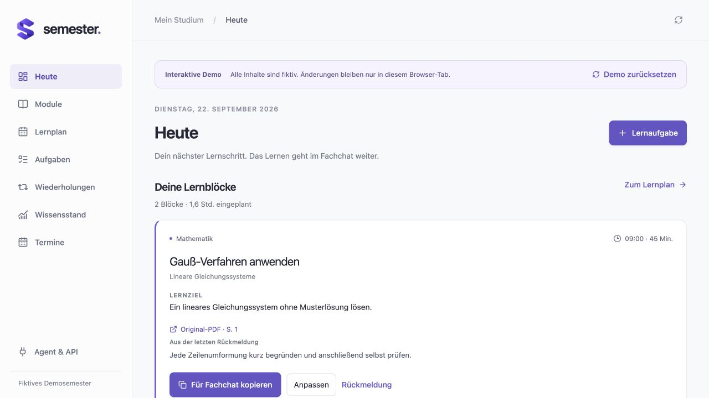
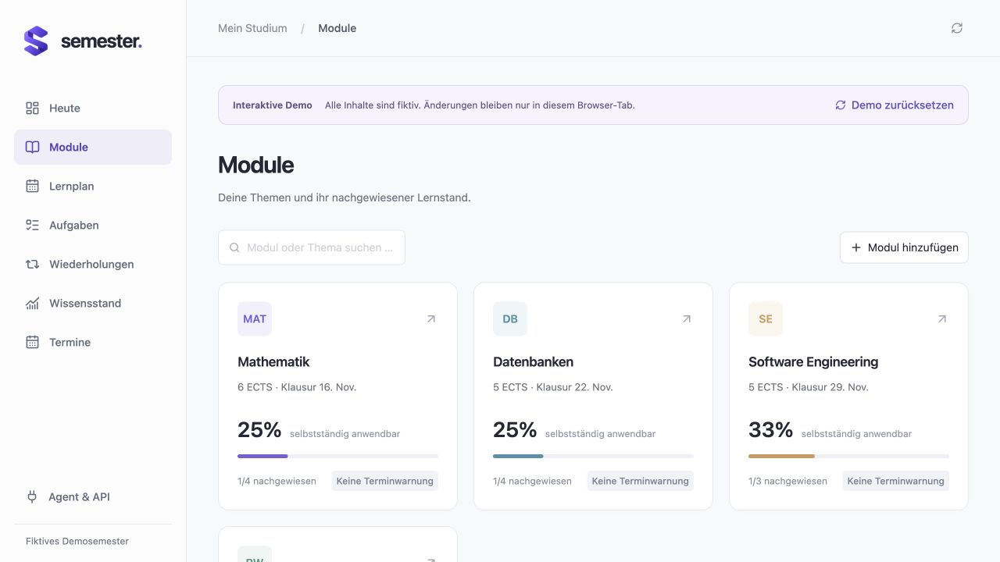
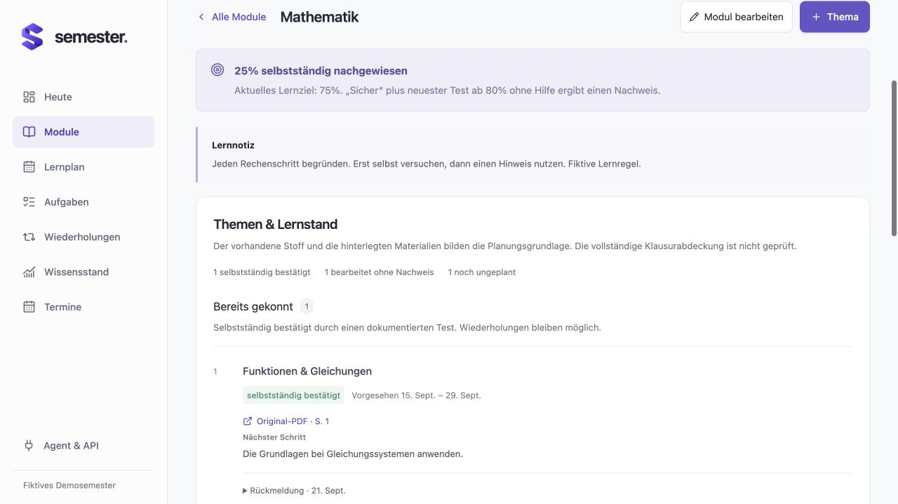
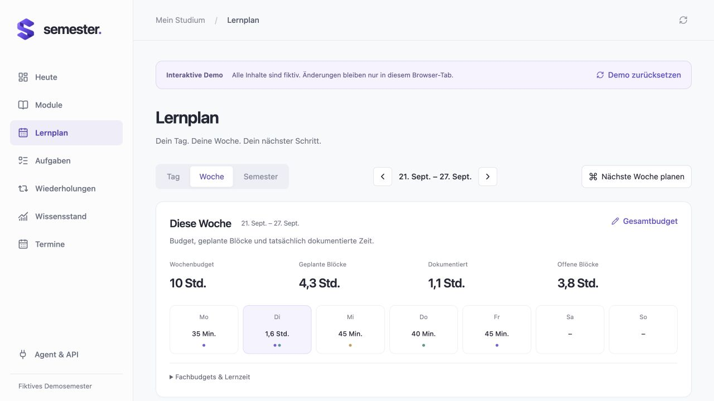
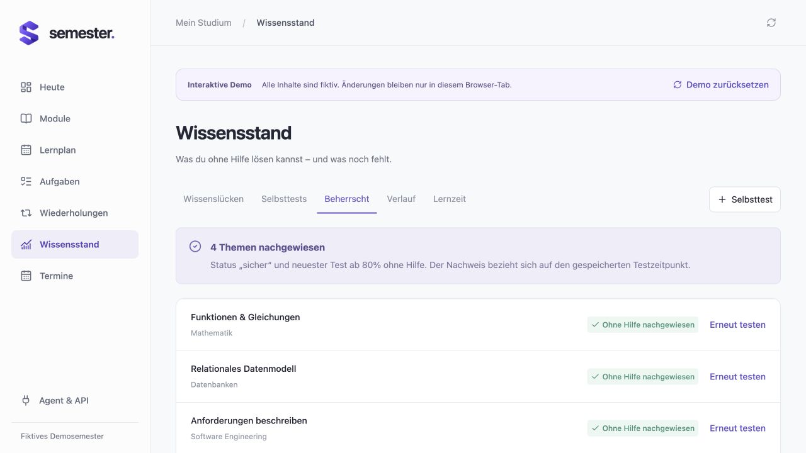
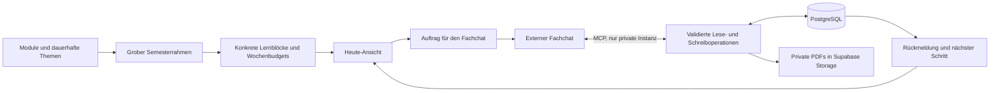

# Semester Cockpit

**Aus Semesterstoff wird ein konkreter Lernplan für heute.**

Semester Cockpit ist eine Web-Anwendung für die Organisation eines Studiums: Module, Themen, Prüfungstermine, Lernblöcke und Rückmeldungen laufen in einer gemeinsamen Datenstruktur zusammen. Das Projekt entstand aus dem eigenen Studienalltag und wird als private Anwendung tatsächlich genutzt. Dieses Repository enthält den bereinigten Quellcode und eine eigenständige Demo mit vollständig fiktiven Daten.

Die zentrale Frage lautet: **Kann ich das Thema selbstständig anwenden?** Ein erledigter Lernblock zählt deshalb als bearbeitet, aber noch nicht als nachgewiesenes Können.

## Das Problem

Unterlagen, Termine und Lernfortschritt verteilen sich schnell auf Kalender, Dateien, Notizen und einzelne Chats. Daraus ergibt sich noch kein realistischer Tagesplan. Zusätzlich geht beim Wechsel zwischen Fachchats der aktuelle Lernstand verloren.

Das Cockpit übernimmt die Organisation: Was steht an, für welches Fach, mit welchem Ziel und in welchem Zeitbudget? Separate Fachchats können über MCP den gespeicherten Kontext und passende Originalunterlagen abrufen und nach einer Lerneinheit eine kurze Rückmeldung speichern. Erklärungen, Aufgabenauswahl und Korrektur bleiben im Fachchat.

## Funktionen

- **Heute:** nächste Lernblöcke mit Fach, Thema, Lernziel, Dauer und Quellenverweisen; kopierbarer Auftrag für den Fachchat.
- **Module:** dauerhafte Themenübersicht mit bereits gekonnten Themen, aktuellem Schwerpunkt und grobem Ausblick bis zur Klausur. Unbekannter Stoff bleibt ausdrücklich offen.
- **Planung:** Semesterrahmen und konkrete Lernblöcke sind getrennt. Verschieben erhält Themen, Quellen und Ergebnisse; Budgets steigen nicht automatisch mit.
- **Lernstand:** bearbeitete Themen, Selbsttests, dokumentierte Lernzeit, offene Schwierigkeiten und Wiederholungen. Selbstständiges Können benötigt einen gesonderten Nachweis.
- **Fachchat-Rückmeldungen:** Thema, tatsächliche Lernzeit, Hilfebedarf, Schwierigkeit und nächster Schritt bleiben unabhängig vom Chatverlauf gespeichert.
- **Private Materialien:** PDFs pro Modul, Quellen bis auf Seiten- und Aufgabennummer sowie gezielter Agentenzugriff über kurzzeitig gültige Download-Links.

Die letzten beiden Punkte verwenden in einer eingerichteten privaten Instanz das Backend. Die öffentliche Demo zeigt diese Abläufe mit Beispieldaten; sie bietet keine aktive MCP-Verbindung und keinen Datei-Upload.

## Demo und Screenshots

Die Demo startet ohne Konto, Datenbank oder Zugangsschlüssel unter `/demo`. Alle Module, Termine, Lernstände und Notizen sind fiktiv. Änderungen betreffen ausschließlich den Zustand im Arbeitsspeicher des Browsers. Neu laden oder „Demo zurücksetzen“ stellt die Fixtures wieder her; es besteht keine Verbindung zu einer privaten Instanz. Die verlinkten Beispiel-PDFs sind eigens erstellte, fiktive Übungsunterlagen. Private Originalunterlagen werden nicht mitgeliefert.

### Heute



### Semesterübersicht



### Module und Themen



### Lernplan



### Wissensstand



## Architektur und Entscheidungen



**Ein Datenmodell, mehrere Zugänge.** In der privaten Instanz verwenden Oberfläche, REST-API und MCP dieselben Entitäten und fachlichen Validierungen. Die Demo simuliert ausgewählte Lernplan-Änderungen lokal und ersetzt keinen Backend-Integrationstest. Lernzeit liegt in Sessions, selbstständiges Können wird aus Themenstatus und Testnachweisen abgeleitet. Es gibt keinen zusätzlichen KI-Fortschrittsstand.

**Themen überleben Terminänderungen.** Themen sind dauerhafte Datensätze. Konkrete Aufgaben verweisen auf sie und können verschoben werden, ohne neue Themen oder Kopien der Ergebnisse anzulegen. Neue konkrete Termine liegen innerhalb der nächsten zwei Wochen; spätere Inhalte bleiben ein grober Themenrahmen.

**Nachvollziehbare Schreibvorgänge.** Backend-Änderungen werden atomar verarbeitet. Revisionen erkennen konkurrierende Änderungen, Idempotenzschlüssel verhindern doppelte Wiederholungen derselben Anfrage. Änderungen landen im Verlauf. Gezielte Fachchat-Werkzeuge prüfen Modulzugehörigkeit und Wochenbudget.

**Getrennte Betriebsarten.** Die Demo verwendet lokale Fixtures und Browserzustand. Nur `COCKPIT_MODE=private` aktiviert die authentifizierte private Instanz mit PostgreSQL und privatem Objektspeicher. Ein Demo-Build mit gesetzten Backend-Credentials wird abgelehnt. Die öffentliche Demo benötigt und erhält keine produktiven Credentials.

Weitere Details: [Lernablauf und MCP](docs/heute-und-fachchats.md), [Agentenleitfaden](public/agent-guide.md), [Sicherheitsmodell](SECURITY.md).

## Tech Stack

| Bereich | Umsetzung |
| --- | --- |
| Web-Anwendung | Next.js App Router, React, TypeScript |
| Oberfläche | Tailwind CSS, wiederverwendbare UI-Komponenten, Lucide Icons und SVG-Diagramme |
| Daten und Validierung | PostgreSQL, Drizzle-Schema, Zod |
| Private Instanz | Supabase Auth und Storage, serverseitiger PostgreSQL-Zugriff |
| Agenten | MCP über HTTP, REST-API, OAuth beziehungsweise scoped Agent-Schlüssel |
| Lokale Tests | TypeScript-Testskripte, PGlite, lokale Auth- und Upload-Fixtures |
| Hosting | Next.js-kompatibler Node.js-Host, beispielsweise Vercel |

## Lokal starten

Voraussetzung: **Node.js ab 22.13** und npm. Ohne gesetzten Betriebsmodus startet die isolierte Demo; `.env.example` macht diese Auswahl ausdrücklich sichtbar.

```bash
npm ci
cp .env.example .env.local
npm run dev
```

Anschließend [localhost:3000/demo](http://localhost:3000/demo) öffnen. Für die Demo werden keine Supabase-Ressourcen angelegt und keine Migrationen benötigt.

```bash
npm run build
npm start
```

Diese Befehle bauen und starten dieselbe Anwendung im Production-Build; das ist keine Verbindung zu einer produktiven Datenbank. Der Betriebsmodus entscheidet über die verfügbaren Funktionen.

## Konfiguration

`.env.example` enthält ausschließlich Platzhalter und aktiviert die Demo. Lokale `.env`-Dateien werden nicht versioniert.

| Variable | Zweck | Demo |
| --- | --- | --- |
| `COCKPIT_MODE` | `demo` für die öffentliche Demo; `private` nur für eine getrennt eingerichtete private Instanz | `demo` |
| `APP_URL` | Öffentliche Basis-URL für Weiterleitungen und OAuth | nicht benötigt |
| `DATABASE_URL` | Serverseitiger PostgreSQL-Zugang | nicht setzen |
| `NEXT_PUBLIC_SUPABASE_URL` | URL des eigenen Supabase-Projekts | nicht setzen |
| `NEXT_PUBLIC_SUPABASE_PUBLISHABLE_KEY` | Öffentlicher Supabase-Client-Schlüssel | nicht setzen |
| `SUPABASE_SECRET_KEY` | Serverseitiger Storage-Schlüssel; alternativ `SUPABASE_SERVICE_ROLE_KEY` | nicht setzen |
| `COCKPIT_OWNER_EMAIL` | Für die private Oberfläche zugelassene, bestätigte E-Mail-Adresse | nicht setzen |

Öffentliche Supabase-Client-Werte sind kein Ersatz für Zugriffskontrollen. Datenbank- und Server-Schlüssel gehören ausschließlich in die Serverkonfiguration. Die [Anleitung für eine private Instanz](docs/private-instance.md) beschreibt die zusätzlichen Voraussetzungen.

## Development Commands

| Befehl | Funktion |
| --- | --- |
| `npm run dev` | Lokaler Next.js-Entwicklungsserver |
| `npm run build` | Production-Build und Framework-Prüfungen |
| `npm start` | Gebauten Next.js-Server starten |
| `npm run lint` | ESLint |
| `npm run typecheck` | TypeScript-Prüfung ohne Ausgabe |
| `npm test` / `npm run test:local` | Lokale Tests mit isolierten Fixtures |

Das Drizzle-Schema und die versionierten SQL-Migrationen bleiben als Datenmodell enthalten. Ein Generator-CLI ist nicht erforderlich und wird nicht mitgeliefert; für die Demo wird keine Migration ausgeführt.

Die lokale Testsuite entfernt Cloud-Credentials aus ihrer Umgebung und verwendet temporäre lokale Datenbanken. Sie prüft unter anderem Validierung, Zugriffskontrollen, Revisionen, Idempotenz, Fachchat-Rückmeldungen, Umplanung und Uploadclient-Abläufe. Echter Supabase-Storage und ein vollständiger OAuth-Ablauf eines externen Chat-Clients benötigen zusätzliche Integrationstests in einer separaten Testinstanz.

## Deployment der öffentlichen Demo

1. Ein **neues** Hosting-Projekt aus diesem Repository anlegen.
2. Next.js als Framework verwenden; Installation `npm ci`, Build `npm run build`.
3. Ausschließlich `COCKPIT_MODE=demo` setzen. Keine Supabase-Integration verknüpfen und keine Environment-Variablen einer privaten Anwendung übernehmen.
4. `/demo` und die Isolation der Demo prüfen. Backend-Endpunkte müssen im Demo-Modus blockiert bleiben.

Ein vorhandenes privates Hosting-Projekt oder eine vorhandene Datenbank wird hierfür nicht benötigt. Dieses Repository enthält weder deren Verknüpfung noch deren Zugangsdaten. Die Demo hat keinen Seed- oder Reset-Befehl für eine Datenbank.

## Projektstruktur

```text
app/                    Seiten, UI-Komponenten und serverseitige Routen
lib/                    Datenmodell, Validierung, Planung, MCP und Authentifizierung
db/                     Drizzle-Schema
supabase/migrations/    SQL-Struktur der optionalen privaten Instanz
tests/                  Lokale Fach- und Sicherheitstests
scripts/                Entwicklungs- und Testwerkzeuge
public/                 Öffentliche Assets und Agentenleitfaden
docs/                   Screenshots und technische Erläuterungen
```

## Grenzen und nächste Schritte

- Ein Fachchat muss seine Rückmeldung tatsächlich speichern. Das Cockpit kann einen externen Client nicht zur Werkzeugnutzung zwingen.
- Ein Selbsttest ist ein dokumentierter Nachweis, keine objektive Garantie des Könnens. Vollständige Stoffabdeckung wird nicht automatisch behauptet.
- Budgets berücksichtigen nur eingetragene Blöcke und Lernzeiten, keine unbekannten Kalenderverpflichtungen.
- Die private Anwendung ist auf eine besitzende Person ausgelegt. Eine Team- oder Hochschulplattform mit Rollenverwaltung ist kein Bestandteil dieses Projekts.

Mögliche Weiterentwicklungen sind eine konfigurierbare Stoffabdeckungsprüfung, bessere barrierefreie Tastaturbedienung, ein Kalenderimport mit Konfliktvorschau und zusätzliche isolierte Integrationstests für externe Agenten. Eine eigene Chatoberfläche oder automatische Bewertung hochgeladener Unterlagen ist derzeit nicht vorgesehen.

## Lizenz

Der Quellcode steht unter der [MIT-Lizenz](LICENSE). Die fiktiven Demo-Inhalte sind Teil des Projekts. Materialien, die eine Person später in einer privaten Instanz hochlädt, erhalten dadurch keine neue Lizenz.
