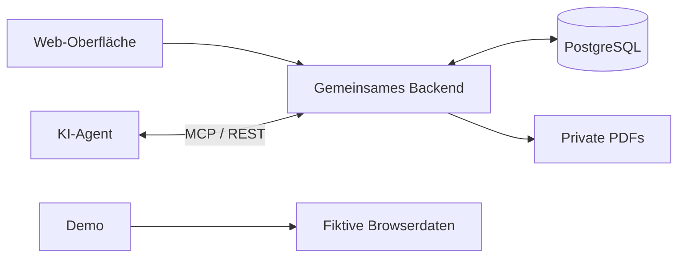

<div align="center">

<picture>
  <source media="(prefers-color-scheme: dark)" srcset="public/brand/semester-lockup-dark.png">
  
</picture>

### Semesterplanung und Lernstand

Module, Lernzeiten und Klausuren planen.<br>
KI-Agenten über MCP Zugriff auf Lernstand und Unterlagen geben.


[](https://github.com/Jonas480185/semester-cockpit/actions/workflows/ci.yml)

[**Demo öffnen**](https://semester-cockpit-demo.vercel.app/demo) · [Lokal starten](#lokal-starten) · [Funktionen](#funktionen) · [Screenshots](#screenshots) · [KI-Agenten und Fachchats](#ki-agenten-und-fachchats) · [Architektur](#architektur)

</div>

<br>


## Überblick

Semester Cockpit ist eine Web-App zur Lernorganisation. Ich habe sie für mein Wirtschaftsinformatik-Studium entwickelt und nutze sie, um Module, Klausurtermine und Lernzeiten zu planen. Für jeden Lernblock lassen sich Thema, Lernziel, Dauer und Unterlagen festhalten. Rückmeldungen und Selbsttests zeigen, was bereits geübt wurde und wo noch Schwierigkeiten bestehen.

Die App lässt sich über MCP mit externen KI-Agenten verbinden. Ein **Fachchat** ist dabei ein Lern-KI-Agent für ein bestimmtes Studienfach: Er greift auf den gespeicherten Lernstand und die freigegebenen Unterlagen zu, erklärt Lerninhalte und begleitet Übungen. Nach einer Lernsitzung kann er eine Rückmeldung im Cockpit speichern. Diese Daten stehen auch für spätere Sitzungen zur Verfügung.

**Die [Demo](https://semester-cockpit-demo.vercel.app/demo) lässt sich im Browser oder lokal mit fiktiven Daten ausprobieren.** Sie benötigt kein Konto und keine Datenbank. Anmeldung, dauerhafte Speicherung, Datei-Upload und die Anbindung von KI-Agenten sind für eine separat eingerichtete private Instanz vorgesehen.

## Funktionen

| Bereich | Funktionen |
| --- | --- |
| **Heute** | Anstehende Lernblöcke mit Thema, Lernziel, Zeitbudget und Quellen anzeigen |
| **Module und Themen** | Studienfächer, Klausurtermine und den zugehörigen Lernstoff verwalten |
| **Planung** | Wochenbudgets pro Fach festlegen und Lernblöcke terminieren oder verschieben |
| **Stundenplan** | Vorlesungen und Übungen als Serien anzeigen; vorhandene Lernblöcke nur mit Modulnamen einblenden |
| **Lernstand** | Lernzeit, Rückmeldungen, Schwierigkeiten und Ergebnisse von Selbsttests erfassen |
| **KI-Agenten** | Lernstand und Unterlagen abrufen sowie Rückmeldungen über MCP speichern |
| **Unterlagen** | In der privaten Instanz PDFs einem Fach zuordnen und Seiten oder Aufgaben als Quellen hinterlegen |

Die Oberfläche bietet einen hellen und einen dunklen Modus sowie eine angepasste Navigation für Mobilgeräte.

## Screenshots


### Dunkler Modus und mobile Ansicht

<p align="center">
  
  
</p>

Die Screenshots und mitgelieferten Beispiel-PDFs enthalten fiktive Daten.

## Lokal starten

Empfohlen: **Node.js 24 und npm**. Die App benötigt mindestens Node.js 22.13; die Testsuite verwendet Node.js 24.

```bash
git clone https://github.com/Jonas480185/semester-cockpit.git
cd semester-cockpit
npm ci
cp .env.example .env.local
npm run dev
```

Die Demo ist unter [localhost:3000/demo](http://localhost:3000/demo) erreichbar. Die Beispielkonfiguration setzt `COCKPIT_MODE=demo`; weitere Zugangsdaten sind dafür nicht erforderlich.

Änderungen in der Demo bleiben nur bis zum Neuladen der Seite erhalten. „Demo zurücksetzen“ stellt ebenfalls die Beispieldaten wieder her. Die Einrichtung mit Anmeldung, Datenbank und Datei-Upload beschreibt [Private Instanz einrichten](docs/private-instance.md).

| Befehl | Zweck |
| --- | --- |
| `npm run dev` | Entwicklungsserver starten |
| `npm run build` · `npm start` | Anwendung bauen und starten |
| `npm run typecheck` | TypeScript prüfen |
| `npm run lint` | Code mit ESLint prüfen |
| `npm test` | Lokale Tests ausführen |

Beim ersten Build werden die Schriften Geist und Geist Mono über `next/font` heruntergeladen. Dafür ist eine Internetverbindung nötig.

Weitere Hinweise zu Konfiguration und Deployment: [Entwicklung und Betrieb](docs/development.md).

## KI-Agenten und Fachchats

Für das Lernen nutze ich einen eigenen Fachchat pro Studienfach. Der Lern-KI-Agent wird in einem externen KI-Client verwendet, der **MCP (Model Context Protocol)** unterstützt. Über diese Schnittstelle kann er die freigegebenen Daten der privaten Instanz lesen und Rückmeldungen speichern.

Der Ablauf einer Lernsitzung:


| Schritt | MCP-Werkzeug | Aufgabe |
| --- | --- | --- |
| **1. Lernstand abrufen** | `semester_module_context` | Themen, Lernregeln, Planung und letzte Rückmeldung lesen |
| **2. Unterlagen öffnen** | `semester_material_download` | Die zugehörige PDF über einen autorisierten, zeitlich begrenzten Download abrufen |
| **3. Lernen** | Fachchat mit dem Lern-KI-Agenten | Lerninhalte erklären lassen und Aufgaben anhand der Unterlagen bearbeiten |
| **4. Rückmeldung speichern** | `semester_module_feedback` | Lernzeit, benötigte Hilfe, Schwierigkeiten und den nächsten Schritt erfassen |
| **5. Ergebnis prüfen** | `semester_module_context` | Die gespeicherte Rückmeldung erneut abrufen |

Mit `semester_reschedule` kann der KI-Agent Lernblöcke innerhalb des Fachbudgets verschieben. Ob der Fachchat die Rückmeldung tatsächlich speichert, hängt vom verwendeten KI-Client und dem Ablauf der Sitzung ab.

MCP (`/api/mcp`, Streamable HTTP) und REST (`/api/v1`) nutzen dasselbe Backend. Der Zugriff wird über OAuth oder widerrufbare Agent-Schlüssel freigegeben. Für Clients mit stdio-MCP gibt es eine [MCP-Brücke](public/semester-mcp.mjs).

Die Werkzeuge für einzelne Fächer prüfen die Zuordnung zum Modul und dessen Budget. Eine allgemeine Schreibfreigabe gilt jedoch für das gesamte Semester. Schlüssel und OAuth-Freigaben verwaltet ausschließlich der angemeldete Besitzer.

Details: [Lernablauf und Werkzeugverträge](docs/heute-und-fachchats.md) · [Agentenleitfaden](public/agent-guide.md).

## Technischer Aufbau

| Bereich | Umsetzung |
| --- | --- |
| **Framework** | Next.js 16 App Router, React 19, TypeScript |
| **Oberfläche** | Tailwind CSS 4, Geist, Lucide Icons |
| **Daten und Validierung** | PostgreSQL, Drizzle-Schema, Zod |
| **Anmeldung und Dateien** | Supabase Auth und Storage in der privaten Instanz |
| **Schnittstellen** | MCP, REST, OAuth und Agent-Schlüssel |
| **Tests** | TypeScript-Testskripte, PGlite und simulierte externe Dienste |

### Architektur


```mermaid
flowchart LR
    UI[Web-Oberfläche] --> API[Gemeinsames Backend]
    Agent[KI-Agent] <-->|MCP / REST| API
    API <--> DB[(PostgreSQL)]
    API --> PDF[Private PDFs]
    Demo[Demo] --> Fixtures[Fiktive Browserdaten]
```

- **Gemeinsame Regeln:** Oberfläche und KI-Agenten arbeiten mit demselben Datenmodell. REST und MCP verwenden dieselben Validierungen und Planungsregeln.
- **Themen und Termine:** Themen bleiben unabhängig von einzelnen Lernblöcken gespeichert. Beim Verschieben eines Blocks bleiben seine ID, Quellen und Ergebnisse erhalten.
- **Schreibzugriffe:** Transaktionen führen zusammengehörige Änderungen gemeinsam aus. Revisionen erkennen veraltete Datenstände; Idempotenzschlüssel verhindern, dass dieselbe Anfrage mehrfach verarbeitet wird. Ein Verlauf protokolliert die Änderungen.
- **Lernstand:** Ein Thema zählt in der Auswertung als selbstständig bestätigt, wenn sein Status `sicher` ist und der neueste Selbsttest mindestens 80 Prozent ohne Hilfe erreicht. Das Abschließen eines Lernblocks allein erfüllt diese Bedingung nicht.
- **Demo-Modus:** Backend-Endpunkte sind gesperrt. Sind dennoch Backend-Zugangsdaten gesetzt, bricht die Anwendung ab. `COCKPIT_MODE=private` aktiviert die private Instanz.

Quellcode: [Datenmodell](lib/model.ts) · [Backend](lib/server.ts) · [Planungsregeln](lib/study-planning.ts) · [Demo-Modus](lib/runtime-mode.ts).

## Tests und Sicherheit

Die [GitHub-Actions-Pipeline](.github/workflows/ci.yml) führt Lint, Build, Typprüfung und Tests aus. Sie prüft außerdem die Abhängigkeiten: Hohe und kritische Befunde in Laufzeitabhängigkeiten lassen die Pipeline fehlschlagen. Befunde in Entwicklungswerkzeugen werden separat gemeldet.

Die Tests laufen mit fiktiven Daten, temporären PostgreSQL-/PGlite-Datenbanken und simulierten externen Diensten. Geprüft werden unter anderem Eingabevalidierung, Benutzertrennung, Revisionen, Idempotenz, Rückmeldungen, Umplanung und der Uploadclient. Die Anbindung an den externen OAuth-Dienst und den echten Supabase-Storage benötigt zusätzliche Integrationstests.

Das Backend prüft Zugriffsrechte und beschränkt Abfragen auf den jeweiligen Besitzer. Eingaben werden mit Zod validiert, SQL-Abfragen verwenden Parameter. PDFs liegen im privaten Storage; Downloadlinks werden nach einer Berechtigungsprüfung erstellt und sind zeitlich begrenzt. Die PDF-Prüfung umfasst keinen Malware-Scan.

Hinweise zum vertraulichen Melden von Sicherheitslücken: [SECURITY.md](SECURITY.md).

## Projektstand

Die private Instanz ist für die Nutzung durch eine einzelne Person ausgelegt. Planung und Auswertung berücksichtigen die erfassten Themen, Lernblöcke und Zeiten. Selbsttests zeigen den Stand zu den geprüften Aufgaben; eine vollständige Abdeckung des Lernstoffs wird derzeit nicht überprüft.

Mögliche Erweiterungen sind eine Übersicht zur Stoffabdeckung, ein Kalenderimport mit Konfliktvorschau und weitere Integrationstests für externe KI-Clients.

## Lizenz

Der Quellcode und die fiktiven Demo-Inhalte stehen unter der [MIT-Lizenz](LICENSE). Hochgeladene Studienunterlagen unterliegen ihren jeweiligen Nutzungsrechten.

---

<div align="center">
Entwickelt von <a href="https://github.com/Jonas480185">Jonas Lunkwitz</a>
</div>
