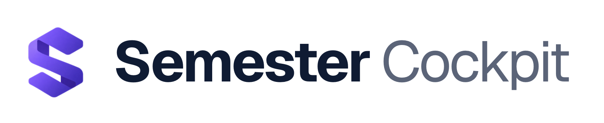
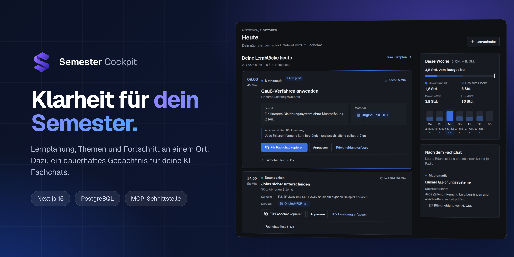
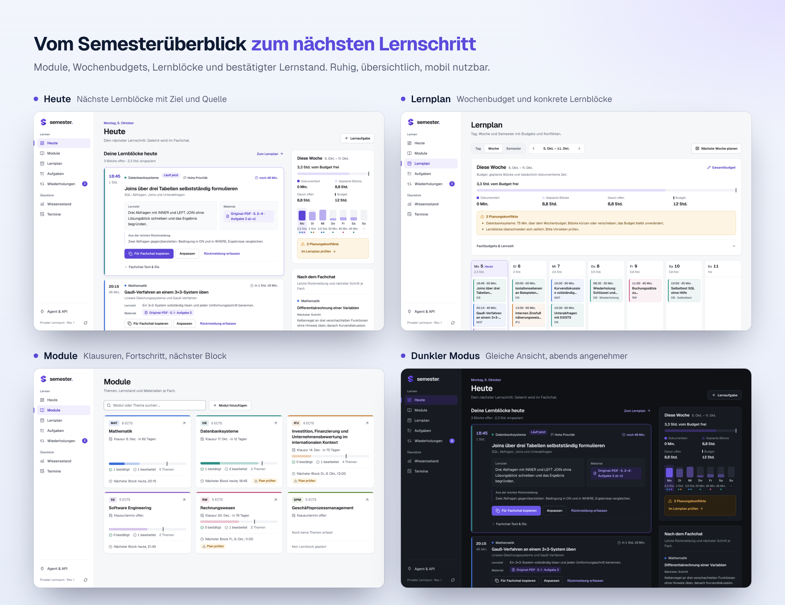
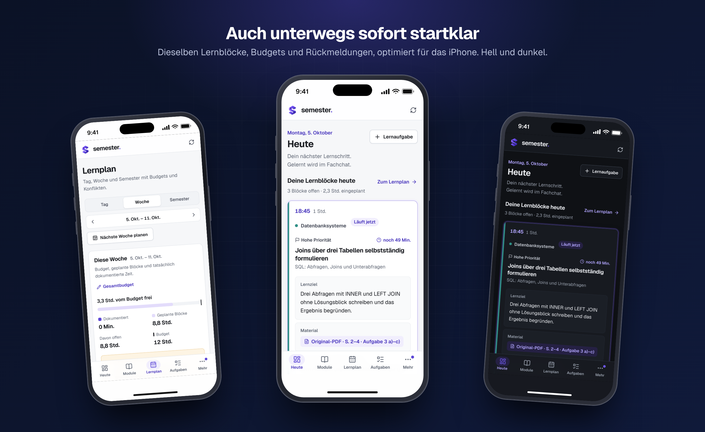
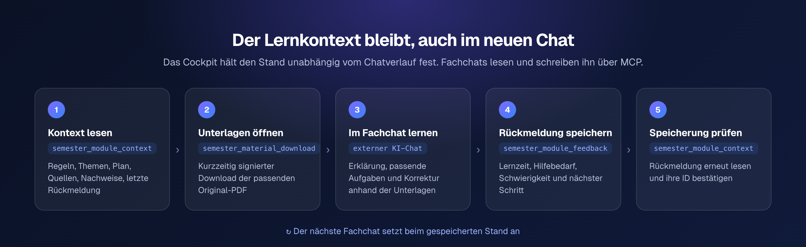
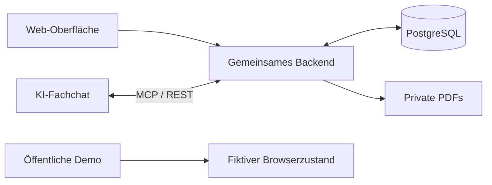

<div align="center">

<picture>
  <source media="(prefers-color-scheme: dark)" srcset="public/brand/semester-lockup-dark.png">
  
</picture>

### Klarheit für dein Semester.

Lernplanung, Themen und Fortschritt an einem Ort.<br>
Dazu ein dauerhaftes Gedächtnis für deine KI-Fachchats.


[](https://github.com/Jonas480185/semester-cockpit/actions/workflows/ci.yml)

[Lokal ausprobieren](#lokal-starten) · [Screenshots](#screenshots) · [Fachchats & MCP](#fachchats--mcp) · [Architektur](#architektur)

</div>

<br>



## Überblick

Aus Semesterstoff wird ein konkreter Lernplan für heute: **welches Fach, welches Thema, welches Ziel und wie viel Zeit?** Semester Cockpit bündelt Module, Klausurtermine, Lernblöcke und Rückmeldungen. Es ist mein persönliches Projekt: Ich, **Jonas Lunkwitz**, konzipiere, entwickle und pflege Semester Cockpit aus meinem eigenen Studienalltag heraus. Die private Anwendung nutze ich tatsächlich.

Gelernt wird im Fachchat. Über MCP liest der Chat den aktuellen Stand, ruft passende Unterlagen ab und speichert die nächste Rückmeldung. So bleibt der Lernkontext auch beim Wechsel in einen neuen Chat erhalten.

**Highlights**

- **Ein klarer nächster Schritt:** Lernblöcke mit Ziel, Zeitbudget, Quellen und kopierbarem Fachchat-Auftrag.
- **Realistische Planung:** Wochenbudgets je Fach, Semesterrahmen und konkrete Termine für die nächsten zwei Wochen.
- **Nachgewiesener Lernstand:** bearbeitete Themen und selbstständig bestätigtes Können bleiben unterscheidbar.
- **Kontext für Agenten:** Themen, Lernregeln, letzte Rückmeldung und nächster Schritt über eine eigene MCP-Schnittstelle.
- **Private Materialien:** PDFs je Modul mit Quellen bis auf Seiten- und Aufgabennummer in der privaten Instanz.
- **Desktop und mobil:** ruhige Oberfläche mit Geist, Modulfarben, kompakter Navigation und systemabhängigem Hell-/Dunkelmodus.

**Ohne Konto ausprobieren:** Dieses Repository enthält eine isolierte Demo mit fiktiven Daten. Sie benötigt keine Datenbank und keine Zugangsschlüssel; MCP und Upload gehören zur privaten Instanz.

## Screenshots



### Mobile Ansicht



Alle Screenshots und mitgelieferten Beispiel-PDFs zeigen eigens erstellte, fiktive Inhalte.

## Fachchats & MCP

Ein neuer Chat sollte wissen, wo du zuletzt aufgehört hast. Das Cockpit hält diesen Stand unabhängig vom Chatverlauf fest. Ein typischer Ablauf in der privaten Instanz:



| Schritt | Werkzeug | Ergebnis |
| --- | --- | --- |
| **1. Kontext lesen** | `semester_module_context` | Lernregeln, Themen, aktueller Plan, Quellen, Nachweise und letzte Rückmeldung |
| **2. Unterlagen öffnen** | `semester_material_download` | Autorisierter, kurzzeitig gültiger Download der passenden Original-PDF |
| **3. Im Fachchat lernen** | Externer KI-Chat | Erklärungen, passende Übungen und Korrektur anhand der Unterlagen |
| **4. Rückmeldung speichern** | `semester_module_feedback` | Tatsächliche Lernzeit, Hilfebedarf, Schwierigkeit und nächster Schritt |
| **5. Speicherung prüfen** | `semester_module_context` | Gespeicherte Rückmeldung erneut lesen und ihre ID bestätigen |

Der nächste Fachchat setzt beim gespeicherten Stand an. Über `semester_reschedule` können Blöcke innerhalb des zugewiesenen Fachbudgets verschoben werden.

MCP über Streamable HTTP (`/api/mcp`) und REST (`/api/v1`) greifen auf dasselbe Backend zu. Agenten erhalten widerrufbare Lese- oder Schreibrechte über OAuth oder Agent-Schlüssel. Für Clients mit stdio-MCP gibt es eine [Brücke ohne zusätzliche Abhängigkeiten](public/semester-mcp.mjs).

Die gezielten Fachwerkzeuge prüfen Modulzugehörigkeit und Budget. Diese fachliche Prüfung ist keine eigene OAuth-Rechtegrenze: Allgemein schreibberechtigte Agenten haben semesterweite Rechte. Verwaltung von Schlüsseln und OAuth-Freigaben bleibt der echten Besitzersitzung vorbehalten.

Details: [Lernablauf & Werkzeugverträge](docs/heute-und-fachchats.md) · [Agentenleitfaden](public/agent-guide.md)

## Funktionen

| Bereich | Umfang |
| --- | --- |
| **Heute** | Nächste Lernblöcke, Lernziel, Zeitbudget, Quellen und letzte Rückmeldung |
| **Module & Themen** | Dauerhafte Stoffübersicht, aktueller Schwerpunkt, Klausurtermine und Themenausblick |
| **Planung** | Semesterrahmen, Wochenbudgets und verschiebbare Blöcke mit stabilen IDs |
| **Lernstand** | Selbsttests, dokumentierte Lernzeit, offene Schwierigkeiten und Wiederholungen |
| **Fachchat-Rückmeldungen** | Thema, Hilfebedarf und nächster Schritt unabhängig vom Chatverlauf gespeichert |
| **Materialien** | Private Modul-PDFs, genaue Quellenverweise und gezielter Agentenabruf |

Die Demo simuliert ausgewählte Änderungen im Arbeitsspeicher des Browsers. Neuladen oder „Demo zurücksetzen“ stellt die Fixtures wieder her. Dauerhafte Speicherung, Anmeldung, MCP und Datei-Upload benötigen eine [separat eingerichtete private Instanz](docs/private-instance.md).

## Tech-Stack

| Bereich | Umsetzung |
| --- | --- |
| **Framework** | Next.js 16 App Router · React 19 · TypeScript |
| **Oberfläche** | Tailwind CSS 4 · Geist · Lucide Icons · SVG-Diagramme |
| **Daten & Validierung** | PostgreSQL · Drizzle-Schema · Zod |
| **Private Instanz** | Supabase Auth & Storage · serverseitiger PostgreSQL-Zugriff |
| **Agenten** | MCP · REST · OAuth · widerrufbare Agent-Schlüssel |
| **Lokale Tests** | TypeScript-Testskripte · PGlite · Auth- und Upload-Fixtures |
| **Hosting** | Next.js-kompatibler Node.js-Host, beispielsweise Vercel |

## Architektur


```mermaid
flowchart LR
    UI[Web-Oberfläche] --> API[Gemeinsames Backend]
    Chat[KI-Fachchat] <-->|MCP / REST| API
    API <--> DB[(PostgreSQL)]
    API --> PDF[Private PDFs]
    Demo[Öffentliche Demo] --> Fixtures[Fiktiver Browserzustand]
```

**Technische Entscheidungen, die sich lohnen anzusehen**

- **Ein Datenmodell für Oberfläche und Agenten.** REST und MCP verwenden dieselben Validierungen und fachlichen Regeln. Lernzeit liegt in Sessions, Nachweise in Themen und Selbsttests.
- **Themen überleben Terminänderungen.** Lernblöcke verweisen auf dauerhafte Themen. Verschieben erhält IDs, Quellen und Ergebnisse, ohne das Wochenbudget automatisch zu erhöhen.
- **Schreibvorgänge bleiben nachvollziehbar.** Transaktionen verarbeiten Änderungen atomar; Revisionen erkennen veraltete Stände, Idempotenzschlüssel verhindern doppelte Wiederholungen. Änderungen landen im Verlauf.
- **Bearbeitet ist nicht beherrscht.** Selbstständig bestätigt erfordert den Themenstatus `sicher` und den neuesten Selbsttest mit mindestens 80 Prozent ohne Hilfe. Eine erledigte Aufgabe allein reicht nicht.
- **Die Demo ist vom Backend getrennt.** Nur `COCKPIT_MODE=private` aktiviert die private Instanz. Im Demo-Modus bleiben Backend-Endpunkte blockiert; gesetzte Backend-Credentials führen zum Abbruch.

Quellcode-Einstieg: [Datenmodell](lib/model.ts) · [Backend](lib/server.ts) · [Planungsregeln](lib/study-planning.ts) · [Demo-Isolation](lib/runtime-mode.ts)

## Qualität & Sicherheit

Die [GitHub-Actions-Pipeline](.github/workflows/ci.yml) führt Lint, Build, Typprüfung und lokale Tests aus. Hohe und kritische Sicherheitsbefunde in Laufzeitabhängigkeiten blockieren die Pipeline; das vollständige Audit einschließlich Entwicklungswerkzeugen wird zusätzlich berichtet.

Die Tests verwenden isolierte Fixtures, temporäre PostgreSQL-/PGlite-Datenbanken und lokale Mocks. Sie decken unter anderem Validierung, Besitzertrennung, Revisionen, Idempotenz, Fachchat-Rückmeldungen, Umplanung und den Uploadclient ab. Externer OAuth und echter Supabase-Storage benötigen ergänzende Integrationstests in einer getrennten Testinstanz.

Serverseitige Autorisierung, Besitzerfilter, Zod-Validierung und parametrisierte Abfragen sichern den Datenzugriff. Original-PDFs bleiben im privaten Storage; Downloads werden erst nach Autorisierung kurzzeitig signiert.

Sicherheitslücken bitte vertraulich melden: [SECURITY.md](SECURITY.md).

## Lokal starten

Voraussetzungen: **Node.js ≥ 22.13 und npm**; für die lokale Testsuite Node.js 24.

```bash
git clone https://github.com/Jonas480185/semester-cockpit.git
cd semester-cockpit
npm ci
cp .env.example .env.local
npm run dev
```

Öffne [localhost:3000/demo](http://localhost:3000/demo). Die Demo startet ohne Konto, Datenbank, Migration oder Seed. `.env.example` wählt ausdrücklich `COCKPIT_MODE=demo`.

| Befehl | Zweck |
| --- | --- |
| `npm run dev` | Entwicklungsserver |
| `npm run build` · `npm start` | Anwendung bauen · gebauten Server starten |
| `npm run typecheck` | TypeScript-Prüfung |
| `npm run lint` | ESLint |
| `npm test` | Lokale Tests mit isolierten Fixtures |

Beim ersten Build lädt `next/font` Geist und Geist Mono herunter; dafür wird Netzzugang benötigt. Anschließend liefert die Anwendung die Schriften selbst aus.

Konfiguration, Projektstruktur und Demo-Deployment: [Entwicklung & Betrieb](docs/development.md). Anmeldung, Datenbank und Storage: [Private Instanz einrichten](docs/private-instance.md).

## Grenzen & Ausblick

Ein Fachchat muss Rückmeldungen tatsächlich speichern; das Cockpit kann die Werkzeugnutzung eines externen Clients nicht erzwingen. Selbsttests dokumentieren Lernnachweise, garantieren aber keine vollständige Stoffbeherrschung. Budgets berücksichtigen nur erfasste Lernblöcke und Zeiten.

Die private Instanz ist für eine besitzende Person ausgelegt. Mögliche Weiterentwicklungen sind eine Stoffabdeckungsprüfung, bessere Tastaturbedienung, Kalenderimport mit Konfliktvorschau und zusätzliche Integrationstests für externe Agenten.

## Lizenz

[MIT](LICENSE) für den Quellcode und die fiktiven Demo-Inhalte. Später hochgeladene Studienunterlagen behalten ihre eigenen Nutzungsrechte.

---

<div align="center">
Entwickelt von <a href="https://github.com/Jonas480185">Jonas Lunkwitz</a> · Aus dem eigenen Studienalltag.
</div>
