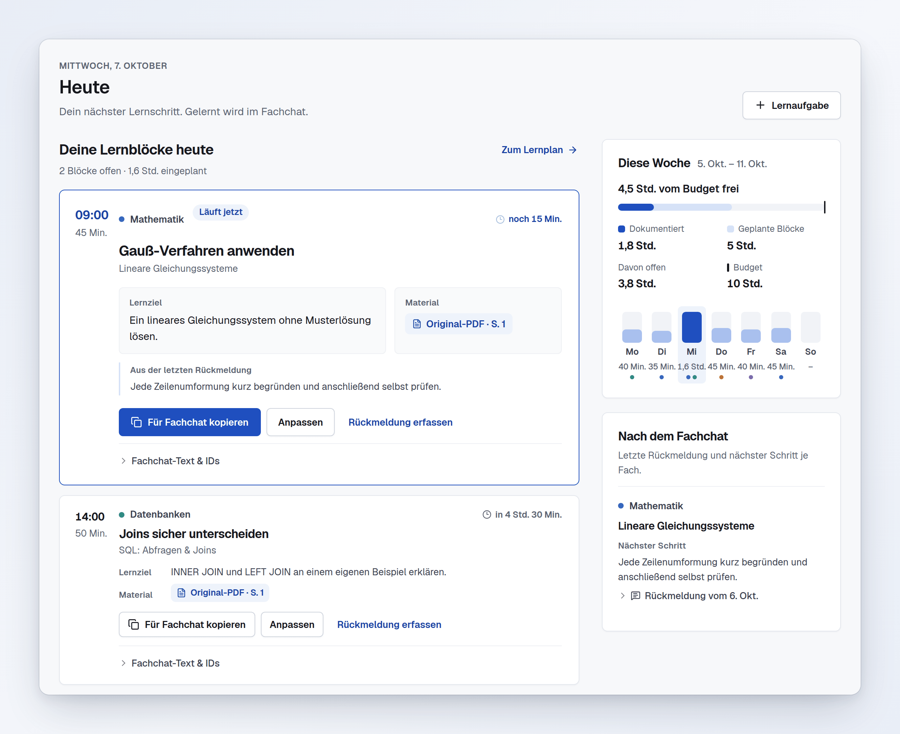
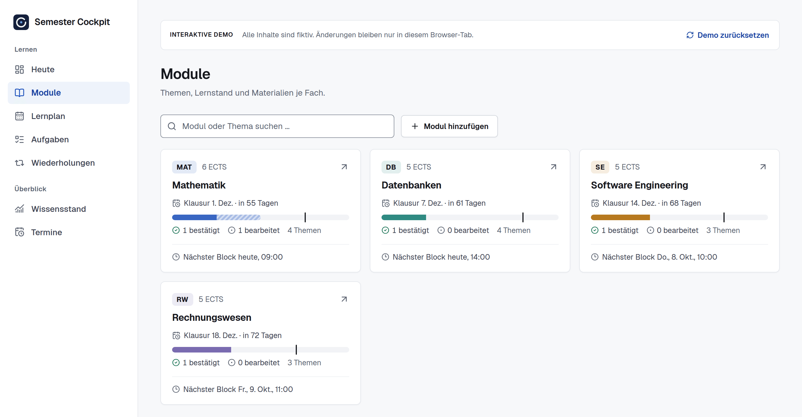
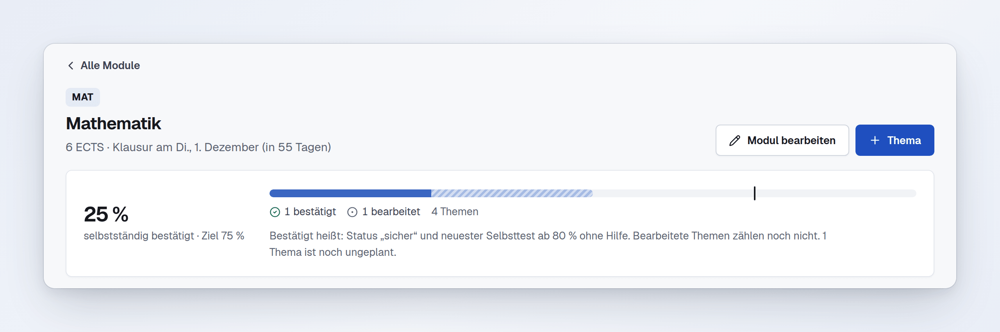
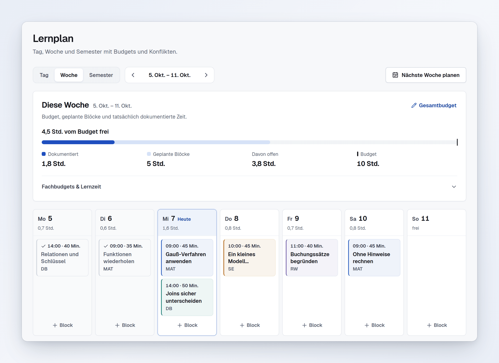
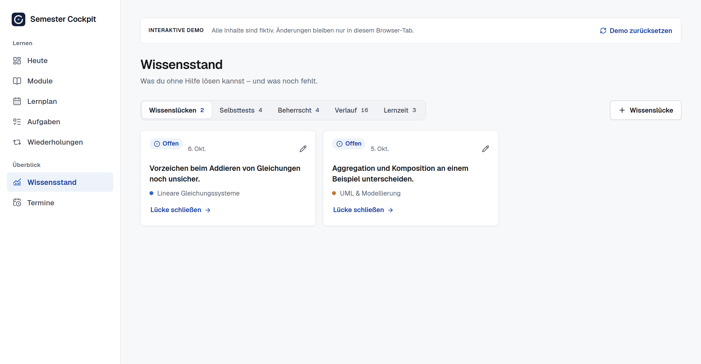
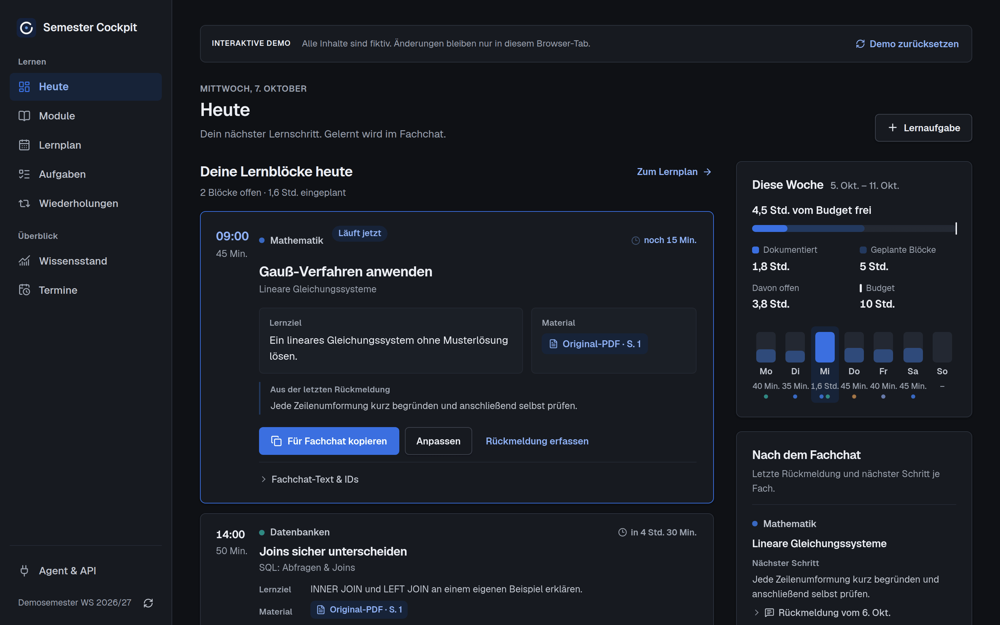
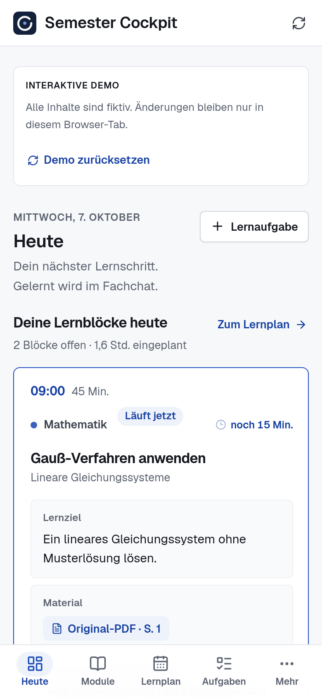
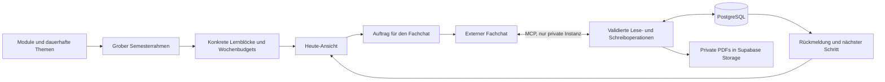

# Semester Cockpit

[](https://github.com/Jonas480185/semester-cockpit/actions/workflows/ci.yml)

**Aus Semesterstoff wird ein konkreter Lernplan für heute.**

Semester Cockpit ist eine Web-Anwendung für die Organisation eines Studiums: Module, Themen, Prüfungstermine, Lernblöcke und Rückmeldungen laufen in einer gemeinsamen Datenstruktur zusammen. Gedacht ist sie nicht als Ersatz für einen Lern-Chatbot, sondern als dessen Gedächtnis: Die App speichert den Lernstand, und KI-Chats greifen über eine eigene MCP-Schnittstelle darauf zu. Das Projekt entstand aus dem eigenen Studienalltag und wird als private Anwendung tatsächlich genutzt. Dieses Repository enthält den Quellcode und eine eigenständige Demo mit vollständig fiktiven Daten.

Die zentrale Frage lautet: **Kann ich das Thema selbstständig anwenden?** Ein erledigter Lernblock zählt deshalb als bearbeitet, aber noch nicht als nachgewiesenes Können.

## Das Problem

Unterlagen, Termine und Lernfortschritt verteilen sich schnell auf Kalender, Dateien, Notizen und einzelne Chats. Daraus ergibt sich noch kein realistischer Tagesplan. Zusätzlich geht beim Wechsel zwischen Fachchats der aktuelle Lernstand verloren.

Das Cockpit übernimmt die Organisation: Was steht an, für welches Fach, mit welchem Ziel und in welchem Zeitbudget? Separate Fachchats können über MCP den gespeicherten Kontext und passende Originalunterlagen abrufen und nach einer Lerneinheit eine kurze Rückmeldung speichern. Erklärungen, Aufgabenauswahl und Korrektur bleiben im Fachchat.

## Agent-first: das Cockpit als Gedächtnis für Fachchats

Ich lerne viel in KI-Chats, ein eigener Chat pro Fach. Das Problem daran: Ein Chat weiß nur, was in seinem Verlauf steht. Welche Themen ich schon sicher kann, was die Klausur ist und was ich beim letzten Mal nicht verstanden habe, muss ich jedes Mal neu erzählen. Deshalb habe ich die Anwendung von Anfang an so gebaut, dass nicht nur ich, sondern auch Agenten ein vollwertiger Nutzer sind.

Das Cockpit ist dabei die zentrale Ablage und der Chat der Ort, an dem gelernt wird:

1. **Kontext lesen.** Ein neuer Fachchat ruft `semester_module_context` auf und bekommt Lernregeln, Themen, den aktuellen Plan, Quellenverweise, Nachweise und die letzte Rückmeldung. Ich muss nichts mehr einfügen oder zusammenfassen.
2. **Originalunterlagen abrufen.** Mit `semester_material_download` holt der Chat die passende PDF. Die Datei liegt privat im Objektspeicher und wird nur über einen Link bereitgestellt, der nach 300 Sekunden abläuft.
3. **Lernen im Chat.** Erklärungen, Aufgabenauswahl und Korrektur bleiben im Chat. Die App ersetzt das nicht.
4. **Rückmeldung speichern.** Am Ende schreibt der Chat mit `semester_module_feedback` zurück: tatsächliche Lernzeit, ob Hilfe nötig war, was schwierig war und was der nächste Schritt ist. Danach liest er den Eintrag noch einmal und prüft, ob er wirklich gespeichert wurde.

Der nächste Chat, auch zu einem anderen Zeitpunkt oder bei einem anderen Anbieter, beginnt dann beim gespeicherten Stand statt bei null.

**Was dafür gebaut ist**

- Ein MCP-Server unter `/api/mcp` mit 14 Werkzeugen für Lesen, Analyse, Planung, Rückmeldungen und Materialien. Die Anmeldung läuft über OAuth mit Freigabe oder über einen Agent-Schlüssel mit eingeschränkten Rechten.
- Eine kleine Brücke ohne Abhängigkeiten ([`public/semester-mcp.mjs`](public/semester-mcp.mjs)) für Clients, die MCP nur über stdio sprechen.
- Ein [Agentenleitfaden](public/agent-guide.md), der die Werkzeuge und den vorgesehenen Ablauf beschreibt.
- Dieselben Datenmodelle und Prüfungen für Oberfläche, REST-API und MCP. Ein Agent darf nichts speichern, was die Oberfläche ablehnen würde.

Weil mehrere Chats parallel schreiben können, sind die Schreibvorgänge entsprechend abgesichert: Revisionen erkennen veraltete Stände, Idempotenzschlüssel verhindern doppelte Einträge bei Wiederholungen, und die gezielten Fachchat-Werkzeuge prüfen, dass ein Chat nur sein eigenes Modul und dessen Wochenbudget ändert.

Zwei Entscheidungen waren mir wichtig. Erstens zählt eine erledigte Aufgabe nicht als Können: Ein Thema gilt erst als sicher, wenn es einen Selbsttest ohne Hilfe mit mindestens 80 Prozent gibt. Zweitens erfindet das System nichts. Unbekannte Lernzeiten bleiben leer, und Themen, die noch nicht bekannt sind, werden nicht geraten.

Die öffentliche Demo zeigt Oberfläche und Datenmodell mit fiktiven Daten. MCP, Datei-Upload und gespeicherte Rückmeldungen sind dort bewusst abgeschaltet, sie gehören zur privaten Instanz. Die [Doku zu Heute und Fachchats](docs/heute-und-fachchats.md) beschreibt den Ablauf im Detail.

## Funktionen

- **Heute:** nächste Lernblöcke mit Fach, Thema, Lernziel, Dauer und Quellenverweisen; kopierbarer Auftrag für den Fachchat.
- **Module:** dauerhafte Themenübersicht mit bereits gekonnten Themen, aktuellem Schwerpunkt und grobem Ausblick bis zur Klausur. Unbekannter Stoff bleibt ausdrücklich offen.
- **Planung:** Semesterrahmen und konkrete Lernblöcke sind getrennt. Verschieben erhält Themen, Quellen und Ergebnisse; Budgets steigen nicht automatisch mit.
- **Lernstand:** bearbeitete Themen, Selbsttests, dokumentierte Lernzeit, offene Schwierigkeiten und Wiederholungen. Selbstständiges Können benötigt einen gesonderten Nachweis.
- **Fachchat-Rückmeldungen:** Thema, tatsächliche Lernzeit, Hilfebedarf, Schwierigkeit und nächster Schritt bleiben unabhängig vom Chatverlauf gespeichert.
- **Private Materialien:** PDFs pro Modul, Quellen bis auf Seiten- und Aufgabennummer sowie gezielter Agentenzugriff über kurzzeitig gültige Download-Links.

## Demo und Screenshots

Die Oberfläche bietet einen hellen und einen dunklen Modus entsprechend der Systemeinstellung, eine kompakte mobile Navigation und klar gegliederte Lernblöcke. Das Design ist bewusst zurückhaltend: neutrale Flächen, ein einzelner Blauton für Aktionen und Auswahl, Modulfarben nur als Orientierung. Die Schrift Geist wird beim Build geladen und anschließend von der Anwendung selbst ausgeliefert.

Die Demo startet ohne Konto, Datenbank oder Zugangsschlüssel unter `/demo`. Alle Module, Termine, Lernstände und Notizen sind fiktiv. Änderungen betreffen ausschließlich den Zustand im Arbeitsspeicher des Browsers. Neu laden oder „Demo zurücksetzen“ stellt die Fixtures wieder her; es besteht keine Verbindung zu einer privaten Instanz. Die verlinkten Beispiel-PDFs sind eigens erstellte, fiktive Übungsunterlagen. Private Originalunterlagen werden nicht mitgeliefert.

### Heute



### Semesterübersicht



### Module und Themen



### Lernplan



### Wissensstand



### Dunkler Modus und mobile Ansicht

<p>
  
  
</p>

## Architektur und Entscheidungen


```mermaid
flowchart LR
    Themen[Module und dauerhafte Themen] --> Rahmen[Grober Semesterrahmen]
    Rahmen --> Bloecke[Konkrete Lernblöcke und Wochenbudgets]
    Bloecke --> Heute[Heute-Ansicht]
    Heute --> Auftrag[Auftrag für den Fachchat]
    Auftrag --> Chat[Externer Fachchat]
    Chat <-->|MCP, nur private Instanz| API[Validierte Lese- und Schreiboperationen]
    API <--> Daten[(PostgreSQL)]
    API --> PDFs[Private PDFs in Supabase Storage]
    Daten --> Feedback[Rückmeldung und nächster Schritt]
    Feedback --> Heute
```

**Ein Datenmodell, mehrere Zugänge.** In der privaten Instanz verwenden Oberfläche, REST-API und MCP dieselben Entitäten und fachlichen Validierungen. Die Demo simuliert ausgewählte Lernplan-Änderungen lokal und ersetzt keinen Backend-Integrationstest. Lernzeit liegt in Sessions, selbstständiges Können wird aus Themenstatus und Testnachweisen abgeleitet. Es gibt keinen zusätzlichen KI-Fortschrittsstand.

**Themen überleben Terminänderungen.** Themen sind dauerhafte Datensätze. Konkrete Aufgaben verweisen auf sie und können verschoben werden, ohne neue Themen oder Kopien der Ergebnisse anzulegen. Neue konkrete Termine liegen innerhalb der nächsten zwei Wochen; spätere Inhalte bleiben ein grober Themenrahmen.

**Nachvollziehbare Schreibvorgänge.** Backend-Änderungen werden atomar verarbeitet. Revisionen erkennen konkurrierende Änderungen, Idempotenzschlüssel verhindern doppelte Wiederholungen derselben Anfrage. Änderungen landen im Verlauf. Gezielte Fachchat-Werkzeuge prüfen Modulzugehörigkeit und Wochenbudget.

**Getrennte Betriebsarten.** Die Demo verwendet lokale Fixtures und Browserzustand. Nur `COCKPIT_MODE=private` aktiviert die authentifizierte private Instanz mit PostgreSQL und privatem Objektspeicher. Ein Demo-Build mit gesetzten Backend-Credentials wird abgelehnt. Die öffentliche Demo benötigt und erhält keine produktiven Credentials.

Weitere Details: [Lernablauf und MCP](docs/heute-und-fachchats.md), [Agentenleitfaden](public/agent-guide.md), [Sicherheitsmodell](SECURITY.md).

## Tech Stack

| Bereich | Umsetzung |
| --- | --- |
| Web-Anwendung | Next.js App Router, React, TypeScript |
| Oberfläche | Tailwind CSS, wiederverwendbare UI-Komponenten, Lucide Icons und SVG-Diagramme |
| Daten und Validierung | PostgreSQL, Drizzle-Schema, Zod |
| Private Instanz | Supabase Auth und Storage, serverseitiger PostgreSQL-Zugriff |
| Agenten | MCP über HTTP, REST-API, OAuth beziehungsweise scoped Agent-Schlüssel |
| Lokale Tests | TypeScript-Testskripte, PGlite, lokale Auth- und Upload-Fixtures |
| Hosting | Next.js-kompatibler Node.js-Host, beispielsweise Vercel |

## Lokal starten

Voraussetzung: **Node.js ab 22.13** und npm. Ohne gesetzten Betriebsmodus startet die isolierte Demo; `.env.example` macht diese Auswahl ausdrücklich sichtbar.

```bash
npm ci
cp .env.example .env.local
npm run dev
```

Anschließend [localhost:3000/demo](http://localhost:3000/demo) öffnen. Für die Demo werden keine Supabase-Ressourcen angelegt und keine Migrationen benötigt.

```bash
npm run build
npm start
```

Das baut und startet die Anwendung im Production-Modus.

Beim ersten Build benötigt `next/font` Netzzugang zu Google Fonts, um Geist und Geist Mono herunterzuladen. Beim späteren Aufruf der Anwendung werden diese Schriften vom eigenen Host geladen.

## Konfiguration

`.env.example` enthält ausschließlich Platzhalter und aktiviert die Demo. Lokale `.env`-Dateien werden nicht versioniert.

| Variable | Zweck | Demo |
| --- | --- | --- |
| `COCKPIT_MODE` | `demo` für die öffentliche Demo; `private` nur für eine getrennt eingerichtete private Instanz | `demo` |
| `APP_URL` | Öffentliche Basis-URL für Weiterleitungen und OAuth | nicht benötigt |
| `DATABASE_URL` | Serverseitiger PostgreSQL-Zugang | nicht setzen |
| `NEXT_PUBLIC_SUPABASE_URL` | URL des eigenen Supabase-Projekts | nicht setzen |
| `NEXT_PUBLIC_SUPABASE_PUBLISHABLE_KEY` | Öffentlicher Supabase-Client-Schlüssel | nicht setzen |
| `SUPABASE_SECRET_KEY` | Serverseitiger Storage-Schlüssel; alternativ `SUPABASE_SERVICE_ROLE_KEY` | nicht setzen |
| `COCKPIT_OWNER_EMAIL` | Für die private Oberfläche zugelassene, bestätigte E-Mail-Adresse | nicht setzen |

Öffentliche Supabase-Client-Werte sind kein Ersatz für Zugriffskontrollen. Datenbank- und Server-Schlüssel gehören ausschließlich in die Serverkonfiguration. Die [Anleitung für eine private Instanz](docs/private-instance.md) beschreibt die zusätzlichen Voraussetzungen.

## Befehle

| Befehl | Funktion |
| --- | --- |
| `npm run dev` | Lokaler Next.js-Entwicklungsserver |
| `npm run build` | Production-Build und Framework-Prüfungen |
| `npm start` | Gebauten Next.js-Server starten |
| `npm run lint` | ESLint |
| `npm run typecheck` | TypeScript-Prüfung ohne Ausgabe |
| `npm test` / `npm run test:local` | Lokale Tests mit isolierten Fixtures |

Das Drizzle-Schema und die SQL-Migrationen beschreiben das Datenmodell der privaten Instanz. Für die Demo wird keine Migration ausgeführt.

Die lokale Testsuite entfernt Cloud-Credentials aus ihrer Umgebung und verwendet temporäre lokale Datenbanken. Sie prüft unter anderem Validierung, Zugriffskontrollen, Revisionen, Idempotenz, Fachchat-Rückmeldungen, Umplanung und Uploadclient-Abläufe. Echter Supabase-Storage und ein vollständiger OAuth-Ablauf eines externen Chat-Clients benötigen zusätzliche Integrationstests in einer separaten Testinstanz.

## Deployment der öffentlichen Demo

1. Ein **neues** Hosting-Projekt aus diesem Repository anlegen.
2. Next.js als Framework verwenden; Installation `npm ci`, Build `npm run build`.
3. Ausschließlich `COCKPIT_MODE=demo` setzen. Keine Supabase-Integration verknüpfen und keine Environment-Variablen einer privaten Anwendung übernehmen.
4. `/demo` und die Isolation der Demo prüfen. Backend-Endpunkte müssen im Demo-Modus blockiert bleiben.

Die Demo braucht keine Datenbank und keinen Seed.

## Projektstruktur

```text
app/                    Seiten, UI-Komponenten und serverseitige Routen
lib/                    Datenmodell, Validierung, Planung, MCP und Authentifizierung
db/                     Drizzle-Schema
supabase/migrations/    SQL-Struktur der optionalen privaten Instanz
tests/                  Lokale Fach- und Sicherheitstests
scripts/                Entwicklungs- und Testwerkzeuge
public/                 Öffentliche Assets und Agentenleitfaden
docs/                   Screenshots und technische Erläuterungen
```

## Grenzen und nächste Schritte

- Ein Fachchat muss seine Rückmeldung tatsächlich speichern. Das Cockpit kann einen externen Client nicht zur Werkzeugnutzung zwingen.
- Ein Selbsttest ist ein dokumentierter Nachweis, keine objektive Garantie des Könnens. Vollständige Stoffabdeckung wird nicht automatisch behauptet.
- Budgets berücksichtigen nur eingetragene Blöcke und Lernzeiten, keine unbekannten Kalenderverpflichtungen.
- Die private Anwendung ist auf eine besitzende Person ausgelegt. Eine Team- oder Hochschulplattform mit Rollenverwaltung ist kein Bestandteil dieses Projekts.

Mögliche Weiterentwicklungen sind eine konfigurierbare Stoffabdeckungsprüfung, bessere barrierefreie Tastaturbedienung, ein Kalenderimport mit Konfliktvorschau und zusätzliche isolierte Integrationstests für externe Agenten. Eine eigene Chatoberfläche oder automatische Bewertung hochgeladener Unterlagen ist derzeit nicht vorgesehen.

## Lizenz

Der Quellcode steht unter der [MIT-Lizenz](LICENSE). Die fiktiven Demo-Inhalte sind Teil des Projekts. Materialien, die eine Person später in einer privaten Instanz hochlädt, erhalten dadurch keine neue Lizenz.
